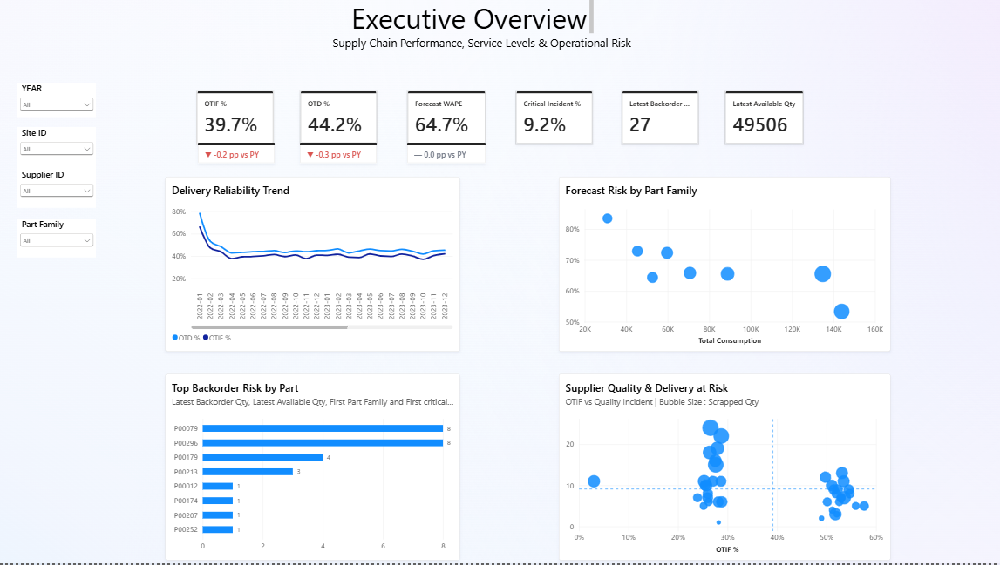
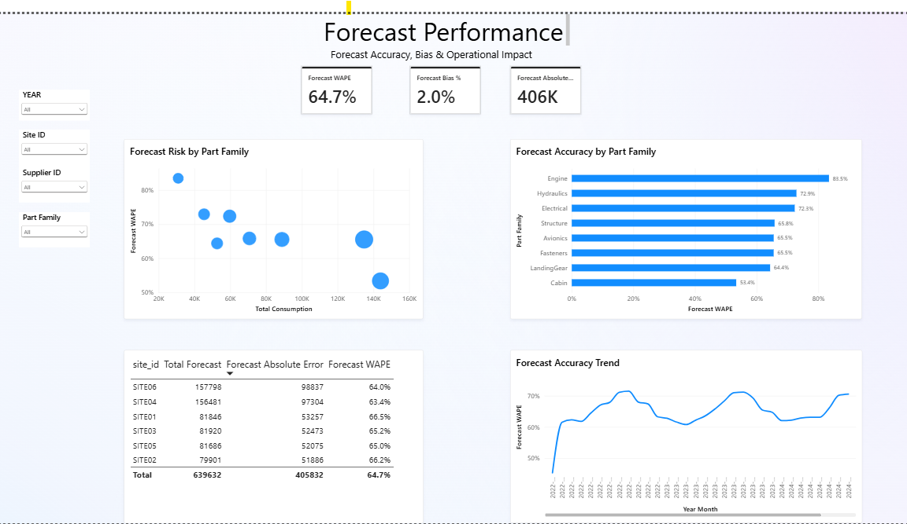
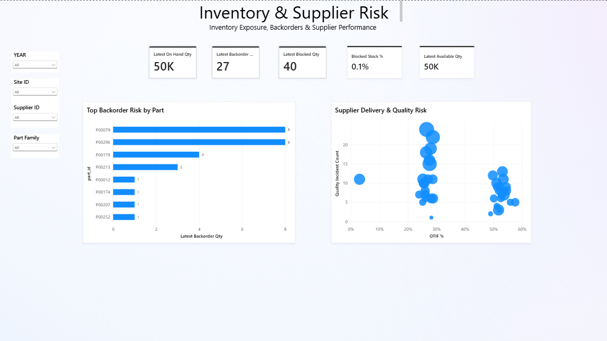
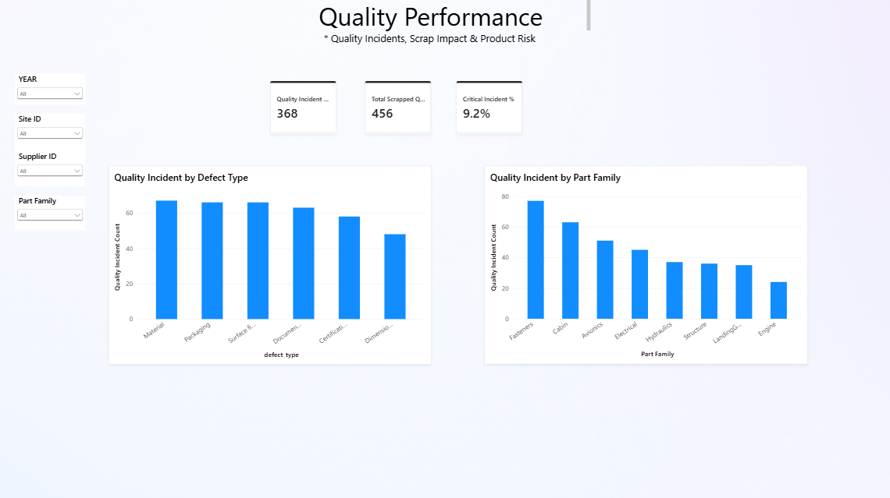

# Aerospace Supply Chain Performance Analytics

End-to-end supply chain analytics project built with *Power BI and SQL*, focused on supplier delivery performance, forecast accuracy, inventory exposure, and quality risk.

The project translates operational supply chain data into decision-oriented KPIs and dashboards, with key Power BI results independently reconciled using SQL.

## Business Objectives

The analysis was designed to answer four core business questions:

- How reliably are suppliers delivering orders on time and in full?
- Where are the largest forecast accuracy and demand-planning risks?
- Which parts and suppliers create the highest inventory and backorder exposure?
- Where are quality incidents and scrap creating operational risk?

## Dashboard
### Executive Overview

### Forecast Performance

### Inventory & Supplier Risk

### Quality Performance

## Key KPIs

| KPI | Result |
|---|---:|
| On-Time Delivery (OTD) | 44.2% |
| In Full | 88.7% |
| OTIF | 39.7% |
| Forecast WAPE | 64.7% |
| Forecast Bias | +2.0% |
| Forecast Absolute Error | ~406K units |
| Latest On-Hand Qty | 49,546 |
| Latest Available Qty | 49,506 |
| Latest Backorder Qty | 27 |
| Quality Incidents | 368 |
| Total Scrapped Qty | 456 |
| Critical Incident Rate | 9.2% |

## Key Business Insights

- *Delivery reliability is the primary service-level constraint.* In Full performance is substantially stronger than OTD, resulting in an overall OTIF of 39.7%.
- *Forecast error is significant despite limited overall bias.* WAPE is 64.7% while aggregate forecast bias is approximately +2%, indicating that over- and under-forecast errors can offset at aggregate level.
- Forecast accuracy varies across part families and sites, enabling prioritization based on both relative error and total operational impact.
- Latest-snapshot inventory analysis identifies specific parts with backorder exposure without incorrectly summing inventory snapshots across time.
- Supplier performance combines delivery and quality measures to distinguish delivery risk, quality risk, and combined supplier exposure.

## SQL Validation

Power BI results were independently reconciled using SQL.

The validation layer includes:

- Dataset grain and duplicate checks
- Missing-value and business-rule checks
- OTD, In Full, and OTIF reconciliation
- Supplier-level delivery validation
- Forecast WAPE, Bias, and Absolute Error reconciliation
- Site and part-family forecast validation
- Latest inventory snapshot validation
- Backorder risk validation
- Quality incident and scrap validation

SQL files:

### SQL Files

- [01 — Data Quality Validation](./sql/01_data_quality.sql)
- [02 — Supplier Delivery Validation](./sql/02_supplier_delivery_validation.sql)
- [03 — Forecast & Inventory Validation](./sql/03_forecast_inventory_validation.sql)
- [04 — Quality Validation](./sql/04_quality_validation.sql)

## Data Quality Note

Date fields in the source data were stored in M/D/YYYY text format. Direct text comparison produced incorrect chronological results in SQL.

Dates were therefore explicitly parsed into a sortable YYYY-MM-DD representation before delivery and latest-snapshot calculations. This ensured that SQL validation followed the same business logic used in Power BI.

## Power BI Features

- Star-schema data model with shared Date, Supplier, Site, and Part dimensions
- DAX measures for OTIF, OTD, forecast accuracy, inventory, and quality KPIs
- Previous-year KPI comparisons
- Report-page supplier tooltip
- Supplier drill-through analysis
- Cross-page slicers and interactive filtering
- Latest-snapshot logic for semi-additive inventory measures

## Tools

*Power BI · DAX · SQL · Data Modeling · Data Quality · KPI Reconciliation · Supply Chain Analytics*

## Dataset

Source: *Aerospace Supply Chain Performance & Forecasting* dataset on Kaggle.

The dataset is synthetic and distributed under the *MIT License*. Raw source files are not redistributed in this repository.

Dataset created by Roberto Carlos T.

## Repository Structure

text
aerospace-supply-chain-analytics/
├── README.md
├── sql/
│   ├── 01_data_quality.sql
│   ├── 02_supplier_delivery_validation.sql
│   ├── 03_forecast_inventory_validation.sql
│   └── 04_quality_validation.sql
└── screenshots/
    ├── executive_overview.png
    ├── forecast_performance.png
    ├── inventory_supplier_risk.png
    └── quality_performance.png

## Project Context

This portfolio project demonstrates how supply chain operational data can be modeled, analyzed, validated, and translated into business-facing performance insights using Power BI and SQL.
